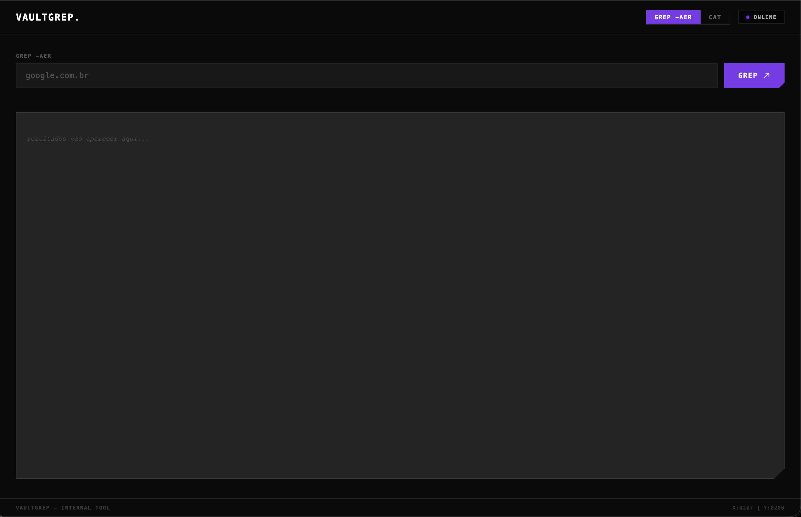

# VAULTGREP

Infraestrutura interna para busca de credenciais vazadas em bases de dados de stealer logs, utilizada como suporte a engajamentos de pentest e notificação de clientes expostos.



---

## Estrutura

```
Vaultgrep/
├── server.py              # Servidor HTTP (Python puro, ThreadingHTTPServer)
├── frontend/
│   └── index.html         # Interface web (editável sem rebuild do Docker)
├── Dockerfile
├── docker-compose.yml
├── .env                   # Credenciais (não versionado)
├── design-system.html     # Referência visual SynSec
└── dbs/                   # Bases de dados em texto plano
    ├── *.txt              # Combo lists e stealer logs na raiz
    └── */passwords.txt    # Arquivos em subdiretórios
```

---

## Formato dos dados

Os arquivos em `dbs/` seguem o formato padrão de stealer logs:

```
<url>:<usuario>:<senha>
```

Exemplos de origem: logs de infostealer, combo lists públicas.

---

## Configuração

Crie um `.env` na raiz do projeto com as credenciais de acesso:

```env
USERNAME_VAULT=admin
PASSWORD_VAULT=suasenha
```

---

## Executar

### Via Docker (recomendado)

```bash
docker compose up -d
```

### Direto (desenvolvimento)

```bash
python3 server.py
```

**Acesso:** `http://localhost:8081`  
**Auth:** Basic Auth com as credenciais do `.env`

---

## Endpoints

| Endpoint | Descrição |
|---|---|
| `GET /` | Interface web |
| `GET /search?q=<termo>&page=<n>` | Busca com streaming em `dbs/` |
| `GET /cat?file=<caminho>` | Leitura de arquivo dentro de `dbs/` |
| `GET /health` | Health check |

---

## Como funciona a busca

**Chunking por tamanho (load balancing):**
- Arquivos ≥ 200 MB ganham chunk exclusivo com `rg --threads=2`
- Arquivos menores são distribuídos em `N_WORKERS` buckets por bytes totais (greedy), garantindo carga balanceada em vez de apenas igual quantidade de arquivos

**Streaming linha a linha:**
- Cada chunk roda `rg` via `subprocess.Popen` com `--line-buffered`
- Todos os workers rodam em paralelo e alimentam uma fila compartilhada
- O servidor envia via HTTP chunked transfer (`Transfer-Encoding: chunked`) conforme as linhas chegam — resultados aparecem no browser em tempo real
- Ao final, os resultados são cacheados no SQLite para consultas repetidas (resposta instantânea)

**Limites:**
- 5.000 matches por arquivo (`--max-count`)
- 100.000 linhas totais por busca
- Timeout de 120 segundos
- Paginação client-side de 5.000 linhas/página (sem requests extras)

**Cache SQLite:**
- TTL de 10 dias
- Primeira busca: streaming; repetição: servido direto do cache

---

## Endpoint `/cat`

Aceita qualquer formato de path — normaliza automaticamente e faz glob se o arquivo exato não existir (útil para nomes com metadata como `{879.591} [HASH].txt`):

```
/dbs/escape60.com.br          → OK (normaliza prefixo)
/app/dbs/escape60.com.br      → OK
dbs/escape60.com.br           → OK
escape60.com.br               → OK (glob automático)
```

---

## Docker

O `docker-compose.yml` monta:

| Volume | Container | Modo |
|---|---|---|
| `./dbs` | `/app/dbs` | read-only |
| `./frontend` | `/app/frontend` | read-only (hot-reload) |
| `cache_data` (named volume) | `/data` | leitura/escrita |

O `frontend/index.html` é lido do disco a cada request — edições no HTML são refletidas imediatamente sem rebuild.

---

## Exemplo de uso

```bash
# Buscar domínio do cliente
curl -u user:senha "http://localhost:8081/search?q=empresa\.com\.br"

# Ler arquivo completo
curl -u user:senha "http://localhost:8081/cat?file=escape60.com.br"
```

---

## Interface

Construída sobre o design system SynSec (`design-system.html`):

- Fonte **Supply** (SynSec CDN)
- Accent **violet** `#7c3aed` — substitui o orange do design system
- Status pill com dot pulsante, barras de loading animadas
- Card de resultados com clip-path diagonal (estilo SynSec)
- Scramble de caracteres no logo e no indicador de streaming
- Rastreador de coordenadas do mouse no footer

---

## Segurança

- Acesso restrito por Basic Auth em todos os endpoints
- Endpoint `/cat` bloqueado contra path traversal — restrito a `dbs/`
- Servidor escuta em `127.0.0.1` localmente, `0.0.0.0` no Docker (exposto só na porta mapeada)
- Dados sensíveis — restringir acesso à rede local ou VPN
- Trocar as credenciais do `.env` antes de expor em rede
